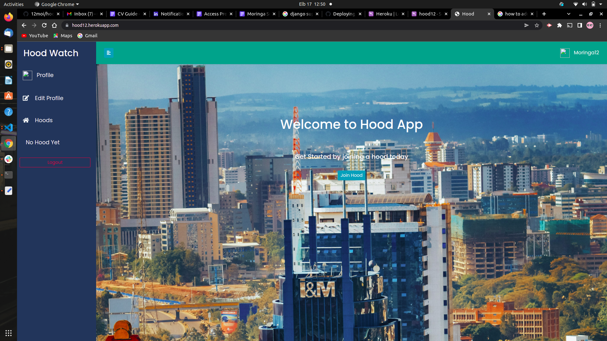

# Name
hood

## Description
This is a neighborhood web app where a user must signup first, be able to join a hood owned by the hood admin, and once you join a hood, one can see businesses and posts in only that wood they belong to.
### live link
[Lets go to hood12](https://hood12.herokuapp.com/)

### Screenshots

## User Story
1. Sign in with the application to start using.
2. Set up a profile about me and a general location and my neighborhood name.
3. Find a list of different businesses in my neighborhood.
4. Find Contact Information for the health department and Police authorities near my neighborhood.
5. Create Posts that will be visible to everyone in my neighborhood.
6. Change My neighborhood when I decide to move out.
7. Only view details of a single neighborhood.

### Setup and Installation
To get the project..  

##### Cloning the repository:
https://github.com/12moi/hood.git

##### Navigate into the folder and install requirements
cd hood

##### Install and activate Virtual
- python3 -m venv virtual - source vertual/bin/activate  

###### Install Dependencies
pip install -r requirements.txt 

##### Setup Database
SetUp your database User,Password, Host then make migrate 

python manage.py makemigrations hood

##### Now Migrate

python manage.py migrate 

##### Run the application
python manage.py runserver 

##### Testing the application
python manage.py test  

Open the application on your browser 127.0.0.1:8000.

### Technology used
1. Python3.8
2. Django 3.2.10
3. Heroku

### Known Bugs
There are no known bugs currently but pull requests are allowed incase you spot a bug

### Contact Information
If you have any question or contributions, please email me at [moi.shadrack@student.moringaschool.com]

### License
License
Copyright (c) 2022 Moi Shadrack